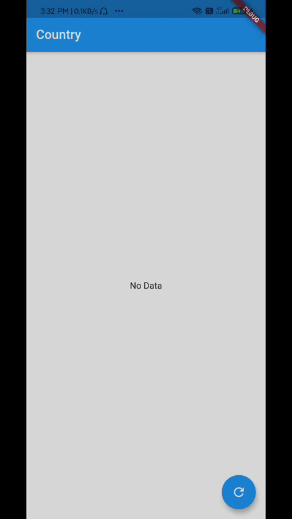

# Flutter Provider Sample

Sample App illustrating the use of Flutter Provider while handling REST API.

## Getting Started

API used : https://restcountries.eu
Endpoint used : https://restcountries.eu/rest/v2/all

## Packages Used in this Application:
  * flutter_svg: ^0.18.0
  * http: ^0.12.2
  * provider: ^4.3.2+2
  
## Show some love ⭐ Star this Repo.
 

# Pull Requests

I welcome and encourage all pull requests. I usually take 24-48 hours to respond to any issue or request. Here are some basic rules to follow to ensure timely addition of your request:

1.  Match the document style as closely as possible.
2.  Please keep PR titles easy to read and descriptive of changes, this will make them easier to merge :)
3.  Check for existing [issues](https://github.com/tsvillain/FlutterProvider/issues) first, before filing an issue.

### Created & Maintained By

[Tekeshwar Singh](https://github.com/tsvillain) ([@tsvillain](https://www.instagram.com/tsvillain))

